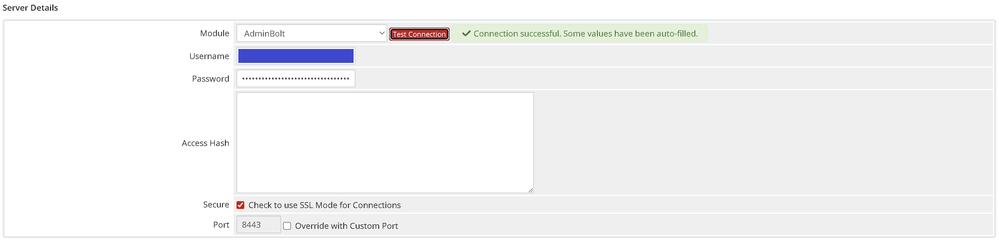
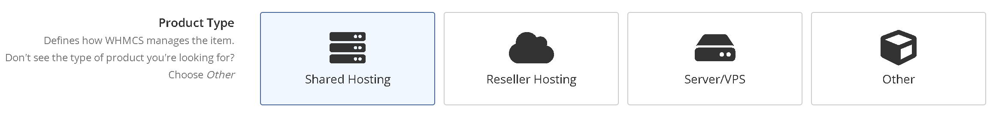
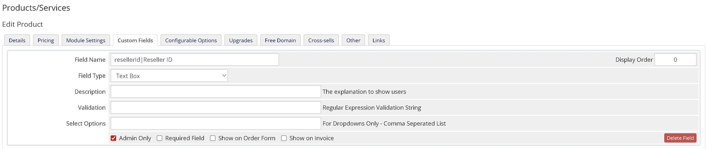
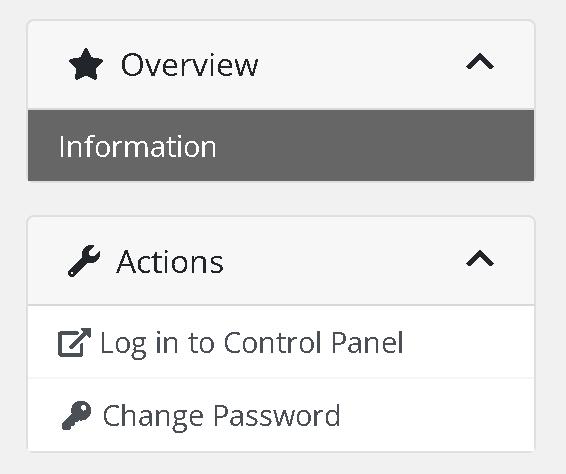
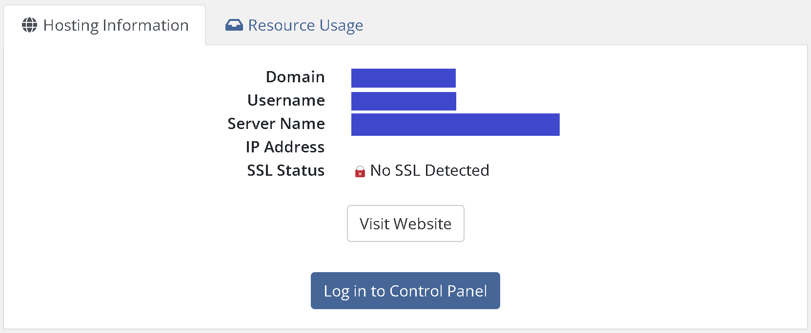
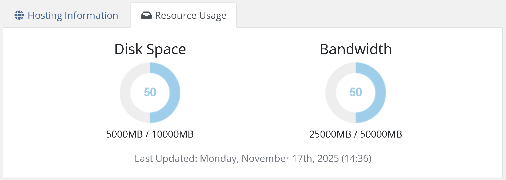
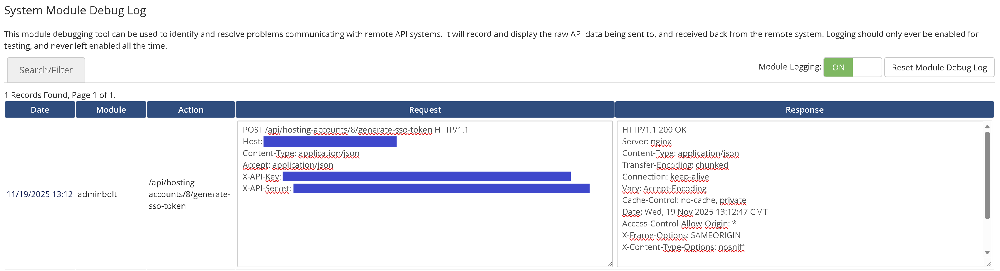

# AdminBolt For WHMCS

## Installation

Download the module package and extract it into the main WHMCS directory. The files will be placed into their appropriate locations including `modules/servers/AdminBolt`.

## Server Configuration

Before the module can be used a new server must be created and configured within WHMCS.

In the server configuration panel select **AdminBolt** in the **Module** field. The **Hostname** field must contain the fully qualified domain name of the AdminBolt instance. The value of `ApiKeyAuth` must be entered in the **Username** field and the value of `ApiSecretAuth` must be provided in the **Password** field. If the AdminBolt installation is running on a port other than 8443, update the port value accordingly.

Once all fields are completed use the **Test Connection** button to verify communication between WHMCS and AdminBolt.

After verifying connectivity create a server group and assign the newly configured server to that group.

## Product Configuration

### Shared Hosting

Create a new product and set the **Product Type** to **Shared Hosting**. In the **Module Settings** tab, choose **AdminBolt** as the **Module Name**, then select the previously created server group in the **Server Group** field.

Once the module is selected the configuration fields appear. These include the **Hosting Plan** dropdown listing all available plans defined in the AdminBolt panel and the **SSH Access** option.

The module automatically creates a custom field named `hostingAccountId|Hosting Account ID`. This field stores the internal service identifier used by AdminBolt and does not need to be visible to the client.

### Reseller Hosting

Create a new product and set the **Product Type** to **Reseller Hosting**. In the **Module Settings** tab, choose **AdminBolt** as the **Module Name**, then select the previously created server group in the **Server Group** field.

The module automatically creates a custom field named `resellerId|Reseller ID`. This field stores the reseller identifier used internally by AdminBolt and should typically remain hidden from the client.

## Client Area

### Shared Hosting

A **Log in to Control Panel** button is added both to the left-side client menu and to the service view itself, where it appears within the **Hosting Information** section. In both places it provides seamless single-sign-on access to the AdminBolt control panel.

The **Resource Usage** section displays disk usage and bandwidth usage data in graphical form.

## Usage Update

Disk space and bandwidth statistics for Shared Hosting services are periodically updated by the WHMCS cron system. No additional configuration is required beyond ensuring that the standard WHMCS cron is executed as recommended.

## Language Files

Language strings used by the module can be customized in the `modules/servers/AdminBolt/lang` directory. The module includes files such as `english.php`, and additional language files can be created or existing ones modified as needed to adjust the wording displayed in the client area.

## Logs

All API communication performed by the module is recorded in the **System Logs -> Module Log** section. Request and response data are stored for diagnostic purposes, including detailed information about any errors encountered by the module during operation.

---

**Note:** This module debugging tool can be used to identify and resolve problems communicating with remote API systems. It will record and display the raw API data being sent to, and received back from the remote system. Logging should only ever be enabled for testing, and never left enabled all the time.
